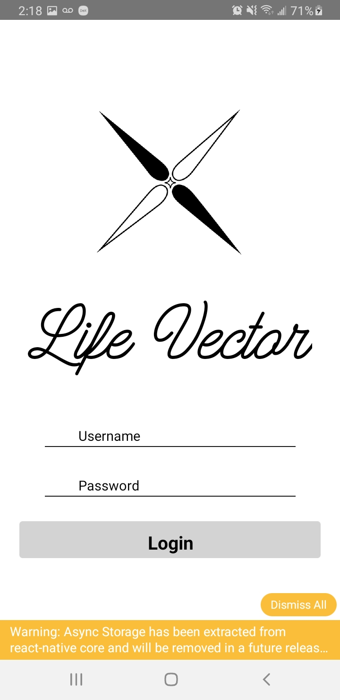
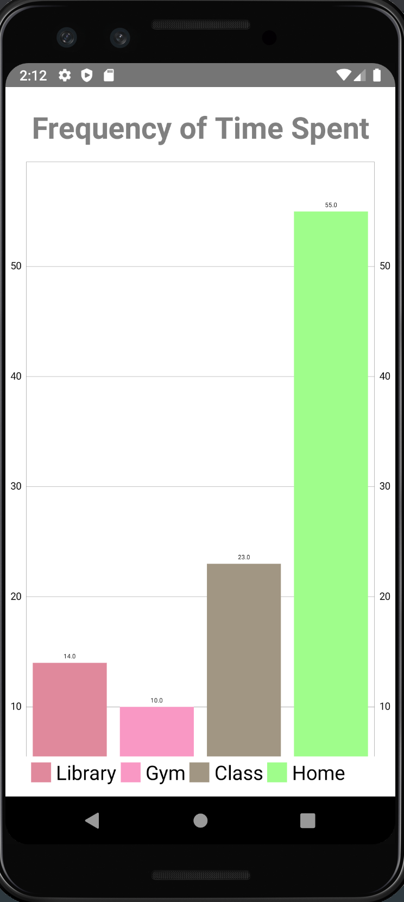

# Life Vector React Native Front-end

## UI as shown on Android Emulator

### Login

### Graph

## Steps to start the front-end

**Note: Ensure that your server is set up first.**

### Step 1: 
Install JDK, NPM, node, Android Studio, android studio build tools, android studio API 28, yarn, and react-native.
Need android studio sdk 28 and android version Pie

### Step 2: 
Make a "local.properties" under group3/LifeVectorMobile/Android and place the following: "sdk.dir = {Your android studio SDK directory}" **without the curly brackets

### Step 3: 
Run 'npm install' in LifeVectorMobile directory

### Step 4: 
Run 'yarn add react-native-charts-wrapper' and 'yarn add @babel/runtime'

### Step 5: 
Run 'react-native link'

### Step 6: 
Run 'react-native run-android'

((Project))

